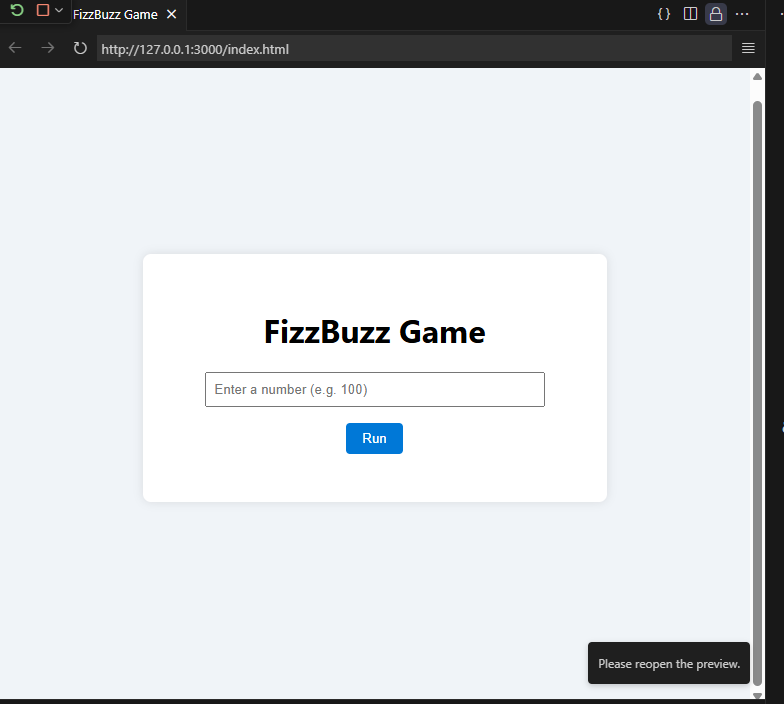

# Add Live Site & Modern Showcase — FizzBuzz Game

This document is a ready-to-paste **README section** that showcases your live website and provides a modern design upgrade snippet. Copy the entire content into your project `README.md` where you want to present the live website.

---

## Live demo (deployed)

**Site:** 🔗 [https://etemesaysarac.github.io/FizzBuzz-Game/](https://etemesaysarac.github.io/FizzBuzz-Game/)

> The site is deployed with GitHub Pages and presents the interactive FizzBuzz demo.

---

## Hero section for README (copy-paste)

Use this hero block at the top of your README to present the live site with a modern visual layout.

```md
<p align="center">
  <a href="https://etemesaysarac.github.io/FizzBuzz-Game/" target="_blank">
    
  </a>
</p>

<h1 align="center">FizzBuzz Game — Interactive Demo</h1>

<p align="center">
  <a href="https://etemesaysarac.github.io/FizzBuzz-Game/" target="_blank">
    
  </a>
</p>

<p align="center">⭐ Try the live demo: <a href="https://etemesaysarac.github.io/FizzBuzz-Game/">https://etemesaysarac.github.io/FizzBuzz-Game/</a></p>

```

---

## Modern UI upgrade — hero + responsive layout (optional copy)

If you want a sleeker look on the site itself, below is a **drop-in** HTML + CSS snippet for a modern hero and layout (glass card, responsive). It keeps your existing `script.js` but improves the visual presentation. Replace the contents of `index.html` (or adapt) with the markup below and put the CSS into `style.css` (or append).

### Modern `index.html` (snippet)

```html
<!doctype html>
<html lang="en">
<head>
  <meta charset="utf-8" />
  <meta name="viewport" content="width=device-width,initial-scale=1" />
  <title>FizzBuzz Game — Interactive Demo</title>
  <link rel="stylesheet" href="style.css">
  <meta property="og:title" content="FizzBuzz Game — Interactive Demo" />
  <meta property="og:url" content="https://etemesaysarac.github.io/FizzBuzz-Game/" />
  <meta property="og:image" content="assets/game.png" />
</head>
<body>
  <header class="site-hero">
    <div class="hero-inner">
      
      <h1>FizzBuzz Game</h1>
      <p class="lead">A modern, accessible FizzBuzz interactive demo — HTML, CSS, JavaScript.</p>
      <p><a class="btn" href="https://etemesaysarac.github.io/FizzBuzz-Game/" target="_blank">Open Live Demo</a></p>
    </div>
  </header>

  <main class="page">
    <section class="center">
      <div class="card">
        <input id="limitInput" type="number" placeholder="Enter a number (e.g. 100)" aria-label="limit" />
        <div class="actions">
          <button id="runBtn">Run</button>
        </div>
        <div id="output" aria-live="polite"></div>
      </div>
    </section>
  </main>

  <script src="script.js"></script>
  <script>
    document.getElementById('runBtn').addEventListener('click', runFizzBuzz);
    // support pressing Enter
    document.getElementById('limitInput').addEventListener('keydown', e => {
      if (e.key === 'Enter') runFizzBuzz();
    });
  </script>
</body>
</html>
```

### Modern additions to `style.css`

Append or replace your `style.css` with the following styles for a modern aesthetic:

```css
:root{
  --bg:#0f1720; /* dark accent */
  --card:#ffffff;
  --muted:#8b98a6;
  --accent:#0066ff;
}
*{box-sizing:border-box}
html,body{height:100%;margin:0;font-family:Inter,system-ui,-apple-system,Segoe UI,Roboto,"Helvetica Neue",Arial}
body{background:linear-gradient(180deg,#f6fbff 0%,#f0f4f8 100%);color:#051025}
.site-hero{padding:48px 16px;text-align:center}
.hero-inner{max-width:920px;margin:0 auto}
.logo{height:64px;margin-bottom:12px}
h1{font-size:clamp(26px,4vw,40px);margin:0 0 8px}
.lead{color:var(--muted);margin:0 0 16px}
.btn{background:var(--accent);color:#fff;padding:10px 18px;border-radius:8px;text-decoration:none;display:inline-block}

.page{display:flex;justify-content:center;padding:28px}
.center{width:100%;max-width:760px}
.card{background:var(--card);padding:26px;border-radius:12px;box-shadow:0 10px 30px rgba(6,24,40,.08)}
.card input[type=number]{width:100%;padding:12px;border-radius:8px;border:1px solid #e6eef8;margin-bottom:12px}
.actions{display:flex;justify-content:center}
.actions button{background:var(--accent);color:#fff;border:none;padding:10px 16px;border-radius:8px;cursor:pointer}
#output{margin-top:18px;max-height:320px;overflow:auto;text-align:left}
#output p{margin:6px 0;padding-left:6px}
.fizz{color:#16a34a}
.buzz{color:#2563eb}
.fizzbuzz{color:#7c3aed;font-weight:700}

/* responsive */
@media (max-width:420px){.card{padding:16px}}
```

---

## Showcasing the live site inside README (badge + preview)

Include a small badge and a short description linking the live site. Paste this where you want the quick CTA:

```md
[](https://etemesaysarac.github.io/FizzBuzz-Game/)

Visit the live demo: https://etemesaysarac.github.io/FizzBuzz-Game/
```

---

## Deployment & GitHub Pages notes

* GitHub Pages can serve content from `main` (root) or `/docs` folder, or from `gh-pages` branch. For a typical flow:

  1. Keep `index.html` in the repository root (or move site to `/docs`).
  2. In the repository `Settings -> Pages`, select the branch (e.g., `main`) and folder (`/ (root)` or `/docs`).
  3. After saving, GitHub will publish to `https://<username>.github.io/<repo>/`.

**Automated deploy** (optional) — use `gh-pages` npm package:

```bash
# one-time
npm install --save-dev gh-pages
# add to package.json scripts
# "deploy": "gh-pages -d ."
# then
npm run deploy
```

This pushes built files to `gh-pages` branch and is convenient when you have a build step.

---

## Recommended README placement

* Insert the provided hero markup and badges at the top of your `README.md` to drive traffic to the live demo.
* Keep a short "How to run locally" section (already in your README) for developers who want to try locally.

---

## Next steps & UX improvements (recommendations)

1. Add a small animated GIF of interaction (record the browser) and include it as `assets/demo.gif` for richer README previews.
2. Add structured JSON output option (`fizzbuzzSequence(limit)`) so the site can offer CSV/JSON export.
3. Add accessibility attributes and keyboard focus styles for improved usability.
4. Configure OpenGraph/Twitter Card images for better sharing (use `assets/game.png` or a custom social preview).

---

If you want, I can:

* Open a new canvas with a complete `index.html` ready to drop in (full file with hero and ARIA), or
* Create a commit patch that updates `README.md` with the hero block and live demo badge and optionally replaces `index.html` + `style.css` with the modern version.

Tell me which one: **(A)** full file patch commit, **(B)** only README update, or **(C)** create modern `index.html` + `style.css` files for you to review.
