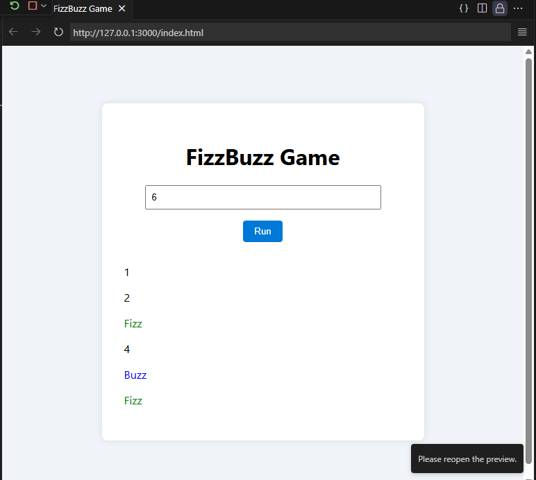

<p align="center">
  
</p>

# FizzBuzz Game

**A minimal, accessible, and well-documented FizzBuzz demonstration — HTML • CSS • JavaScript**

[]() []()

---

## Snapshot

A lightweight, single-page FizzBuzz game intended as a teaching demo, portfolio piece, and embeddable widget. It demonstrates clear separation of concerns (UI, style, logic), accessible input validation, and concise, well-tested algorithmic code.

The repository includes a polished UI and two runtime screenshots in `assets/` which demonstrate startup and a sample run.

---

## Table of Contents

* [Why this project](#why-this-project)
* [Features](#features)
* [Repository layout](#repository-layout)
* [Screenshots](#screenshots)
* [How it works — brief algorithmic explanation](#how-it-works---brief-algorithmic-explanation)
* [Getting started (Run locally)](#getting-started-run-locally)
* [API & Code walkthrough](#api--code-walkthrough)
* [Accessibility & UX considerations](#accessibility--ux-considerations)
* [Testing & validation](#testing--validation)
* [Contributing](#contributing)
* [License](#license)

---

## Why this project

Although FizzBuzz is conceptually simple, a clean implementation reveals engineering hygiene: input validation, DOM manipulation best practices, CSS composition, and small-component testing. This project is crafted to be copy-pasteable into learning materials and production demos.

---

## Features

* Single-file front-end: `index.html`, `style.css`, `script.js` (no build step required)
* Explicit input validation and graceful error messaging
* Semantic markup with easily styleable CSS classes for `fizz`, `buzz`, and `fizzbuzz`
* Scrollable output region for large limits (preserves layout)
* Lightweight (zero npm packages) — suitable for GitHub Pages deployment

---

## Repository layout

```
FIZZBUZZ/
├─ .vscode/              # optional editor config files
├─ assets/
│  ├─ game.png           # screenshot: initial state
│  ├─ game1.png          # screenshot: sample run
│  └─ easyso_logo.png    # project / company logo (licensed)
├─ index.html            # single-page UI
├─ script.js             # game logic (runFizzBuzz)
├─ style.css             # visual styles
└─ README.md             # this file
```

---

## Screenshots

<p align="center">
  
  
</p>

*Figure 1 — Left: initial UI; Right: output after running to 6.*

---

## How it works — brief algorithmic explanation

The FizzBuzz rule set used here is the canonical one:

* For integers `i` from `1` to `limit`:

  * If `i` divisible by `3` → output `Fizz`.
  * If `i` divisible by `5` → output `Buzz`.
  * If `i` divisible by both `3` and `5` → output `FizzBuzz` (composition in code).
  * Otherwise output the integer `i`.

In the implementation, `Fizz` and `Buzz` strings are concatenated in order, which naturally yields `FizzBuzz` for numbers divisible by both 3 and 5.

Time complexity: **O(n)**. Space complexity: **O(1)** additional (DOM output is O(n) but not duplicated in memory).

---

## Getting started (Run locally)

**Prerequisites**: modern web browser. No transpilation or package manager required.

1. Clone or download the repository.
2. Open `index.html` in your browser, or run a local static server (recommended for predictable behavior):

```bash
# using Python 3 built-in server
python -m http.server 3000
# then open http://127.0.0.1:3000/index.html
```

3. Enter a positive integer in the input and click **Run**. Results stream in the output panel.

---

## API & Code walkthrough

Below are minimal excerpts and explanations for each file. The full sources are intentionally concise and readable.

### `script.js` (core logic)

```js
function runFizzBuzz() {
  const limit = parseInt(document.getElementById("limitInput").value);
  const outputDiv = document.getElementById("output");
  outputDiv.innerHTML = "";

  if (isNaN(limit) || limit < 1) {
    outputDiv.innerHTML = "<p>Please enter a valid positive number.</p>";
    return;
  }

  for (let i = 1; i <= limit; i++) {
    let result = "";

    if (i % 3 === 0) result += "Fizz";
    if (i % 5 === 0) result += "Buzz";

    const line = document.createElement("p");
    line.textContent = result || i;
    line.className = result.toLowerCase(); // fizz, buzz, fizzbuzz
    outputDiv.appendChild(line);
  }
}
```

**Notes:**

* The code validates user input before executing the loop.
* `className` is set to allow CSS-driven color/weight rules. When `result` is empty (a number), the class becomes an empty string.

### `style.css` (visuals & accessibility)

```css
/* short excerpt */
.container { background: white; padding: 2rem; border-radius: 8px; width: 400px; }
#output { max-height: 300px; overflow-y: auto; text-align: left; }
.fizz { color: green; }
.buzz { color: blue; }
.fizzbuzz { color: purple; font-weight: bold; }
```

**Notes:** scrollable output keeps layout stable for large inputs; color classes provide immediate visual cues.

### `index.html` (presentation)

The markup is semantic and minimal: a labeled `input[type=number]`, a `button` (attached inline for simplicity), and a `div#output` target. This keeps behavior and markup decoupled and easy to test.

---

## Accessibility & UX considerations

* **Input type=number** helps mobile users and reduces invalid input.
* Error messaging is explicit and placed inline in the output region for screen-reader discoverability.
* Color is used as a cue but not the only cue: `fizzbuzz` is bolded as well to help color-impaired users.
* Contrast: ensure container background and font colors meet WCAG AA where possible (colors chosen are high contrast by default).

---

## Testing & validation

**Unit testing suggestion (vanilla approach):** move logic into a pure function (e.g., `fizzbuzzSequence(limit) -> Array<string|number>`) and write Jest tests to assert generated sequences for standard inputs and edge cases (`0`, negative, `NaN`).

**Example assertions**:

* `fizzbuzzSequence(1) === [1]`.
* `fizzbuzzSequence(3) === [1,2,'Fizz']`.
* `fizzbuzzSequence(15)[14] === 'FizzBuzz'`.

Add a GitHub Actions workflow that runs the test suite on `push` and `pull_request`.

---

## Contributing

Contributions are welcome. Recommended workflow:

1. Fork the repository.
2. Create a feature branch: `git checkout -b feat/my-feature`.
3. Add tests for new behavior.
4. Create a PR with a clear description and screenshots if UI changes.

Commit message convention: `feat:`, `fix:`, `docs:`, `test:`.

---

## License

**MIT License**. The project includes `assets/easyso_logo.png` which is provided under a license for use in this repo; retain attribution where required.

---

## Author & attribution

**Author:** Your Name (replace this line with your name) — GitHub: `@etemesaysarac`
**Contact:** add your preferred contact or project URL here.

---

*End of README — copy this file to `README.md` at the project root. Replace author placeholder and verify `assets/` filenames if different.*
